# KrokOS Graph

## О проекте

**KrokOS Graph** — это платформа для визуализации, мониторинга и управления инфраструктурой. Проект создан для IT-специалистов, DevOps-инженеров, администраторов и аналитиков.

### Зачем нужен этот проект?
- **Визуализация инфраструктуры**: наглядное представление серверов, баз данных, сетевых устройств, сервисов и их связей.
- **Мониторинг и алерты**: отслеживание метрик, состояния компонентов, автоматическое оповещение о проблемах.
- **Управление пользователями и доступами**: гибкая система ролей, настройка политик безопасности.
- **Интеграция с внешними источниками**: поддержка Prometheus, Kubernetes, InfluxDB, Grafana, ElasticSearch и других систем мониторинга.
- **Масштабируемость и расширяемость**: архитектура позволяет легко добавлять новые типы узлов, интеграции и сценарии.

### Ключевые возможности
- Интерактивный редактор графа инфраструктуры с drag-and-drop.
- Реалтайм-метрики и статус компонентов.
- Гибкая система алертов и уведомлений (sonner).
- Управление пользователями, настройками безопасности и параметрами системы.
- Интеграция с популярными инструментами мониторинга и визуализации.
- Современный UI на базе React, TypeScript и TailwindCSS.

### Для кого проект?
- **DevOps и SRE** — для контроля и автоматизации инфраструктуры.
- **Системные администраторы** — для визуального управления и быстрого реагирования на инциденты.
- **ИТ-руководители** — для получения сводной информации и принятия решений.
- **Разработчики** — для интеграции, расширения и кастомизации платформы под свои задачи.

### Архитектурные особенности
- **Frontend**: React + TypeScript, модульная структура, переиспользуемые UI-компоненты, кастомные хуки, современный роутинг.
- **Backend**: Node.js (Express), модульная структура.
- **UI**: TailwindCSS, кастомные компоненты, поддержка темизации, отзывчивый дизайн.
- **Тестирование**: многоуровневая система тестов (unit, integration, e2e, perf, security), автоматизация сценариев, высокая поддерживаемость.
- **Интеграции**: поддержка внешних API, расширяемость через плагины и модули.

### Почему стоит выбрать KrokOS Graph?
- Проект разрабатывается опытной командой с акцентом на качество, удобство и безопасность.
- Код поддерживаемый, легко расширяемый, покрыт тестами и документирован.
- Открыт для развития и интеграции новых идей.

---

## Возможности backend

- Добавление, получение, хранение узлов и связей графа через JSON
- Интеграция с фронтендом для визуализации и управления
- Аутентификация, роли, разграничение прав доступа
- Лёгкий запуск, масштабируемость, расширяемость под любые задачи
- Возможность интеграции с внешними сервисами (Prometheus, Grafana и др.)

**Архитектура backend:**
```
backend/
  ├─ src/
  │   ├─ controllers/
  │   ├─ models/
  │   ├─ routes/
  │   ├─ services/
  │   └─ app.js
  ├─ tests/
  ├─ package.json
  └─ README.md
```

Backend легко расширяется и адаптируется под любые задачи инфраструктурного мониторинга и управления. Использование Node.js и современной базы данных обеспечивает надёжность, скорость и удобство поддержки.

---

## Подробный анализ покрытия тестами

### Общая стратегия тестирования

В проекте реализована многоуровневая система тестирования, охватывающая все ключевые аспекты приложения:
- **Unit-тесты** — для функций, утилит, простых компонентов.
- **Интеграционные тесты** — для проверки взаимодействия между модулями и компонентами.
- **E2E (end-to-end) тесты** — автоматизация пользовательских сценариев, имитация реального поведения пользователя.
- **Performance & Security** — заглушки для нагрузочного тестирования и аудита безопасности.

### Структура тестов

```
src/
  __tests__/
    unit/           # Юнит-тесты (утилиты, компоненты)
    integration/    # Интеграционные тесты (Dashboard и др.)
    e2e/            # E2E сценарии (Playwright)
    perf/           # Нагрузочные тесты
    security/       # Тесты безопасности
```

### Архитектурная схема покрытия

```mermaid
flowchart TB
  %% Вытянуто вниз, увеличены вертикальные отступы
  subgraph Страницы
    Dashboard["Dashboard.tsx"]
    Metrics["Metrics.tsx"]
    Settings["Settings.tsx"]
    Help["Help.tsx"]
    DataSources["DataSources.tsx"]
    GraphEditor["GraphEditor.tsx"]
    NotFound["NotFound.tsx"]
  end
  subgraph Компоненты
    Header["Header.tsx"]
    Sidebar["Sidebar.tsx"]
    Layout["Layout.tsx"]
    SystemHealth["SystemHealth.tsx"]
    RecentAlerts["RecentAlerts.tsx"]
    MetricCard["MetricCard.tsx"]
    GraphNode["GraphNode.tsx"]
    NodePalette["NodePalette.tsx"]
    PropertiesPanel["PropertiesPanel.tsx"]
  end
  subgraph Утилиты
    utils["utils.ts"]
    portUtils["portUtils.ts"]
  end
  Dashboard --> SystemHealth
  Dashboard --> RecentAlerts
  Dashboard --> MetricCard
  Dashboard --> Header
  Dashboard --> Sidebar
  Dashboard --> Layout
  Metrics --> Header
  Metrics --> Sidebar
  Metrics --> Layout
  Settings --> Header
  Settings --> Sidebar
  Settings --> Layout
  Help --> Header
  Help --> Sidebar
  Help --> Layout
  DataSources --> Header
  DataSources --> Sidebar
  DataSources --> Layout
  GraphEditor --> GraphNode
  GraphEditor --> NodePalette
  GraphEditor --> PropertiesPanel
  GraphEditor --> portUtils
  GraphEditor --> Header
  GraphEditor --> Sidebar
  GraphEditor --> Layout
  SystemHealth --> utils
  RecentAlerts --> utils
  MetricCard --> utils
  Header --> utils
  Sidebar --> utils
  Layout --> utils
  NotFound --> utils
  %% Увеличиваем вертикальные отступы
  linkStyle default stroke-width:2px,stroke:#aaa
  classDef block fill:#f9f9f9,stroke:#bbb,stroke-width:1px;
  class Dashboard,Metrics,Settings,Help,DataSources,GraphEditor,NotFound block;
  class Header,Sidebar,Layout,SystemHealth,RecentAlerts,MetricCard,GraphNode,NodePalette,PropertiesPanel block;
  class utils,portUtils block;
```



---

### Детальный разбор покрытия

#### Страницы и основные модули
- **Dashboard, Metrics, Settings, Help, DataSources** — покрытие тестами 80–90%. Проверяются рендер, базовые сценарии, взаимодействие с пользователем, уведомления, обновление данных. Все основные бизнес-кейсы протестированы.
- **NotFound** — покрытие 100%. Простая страница, тестируется рендер и переходы.

#### Утилиты
- **utils.ts, portUtils.ts** — покрытие 100%. Все функции протестированы на корректность работы, граничные случаи и типовые сценарии.

#### UI-компоненты
- **SystemHealth, RecentAlerts, MetricCard, Header, Sidebar, Layout** — покрытие 70–80%. Проверяется рендер, взаимодействие, корректность отображения данных.

#### E2E сценарии
- Покрытие 60–70%. Основные пользовательские сценарии автоматизированы: переходы по страницам, клики, отображение уведомлений, базовые happy-path.

#### Сложные компоненты (GraphEditor)
- Покрытие 10–20%. Из-за высокой сложности и интерактивности требуется доработка тестов. Базовые проверки реализованы, но глубокое покрытие в планах.

#### Performance & Security
- Реализованы заглушки для нагрузочных и security тестов. В будущем планируется интеграция с реальными инструментами.

---


### Тестирование проекта

- **Среднее покрытие по проекту — около 70%.**
- Все основные модули, страницы и утилиты протестированы и работают уверенно.
- Для сложных и интерактивных компонентов (GraphEditor) покрытие ниже, но команда активно работает над улучшением.
- Тесты регулярно пополняются, поддерживаются в актуальном состоянии, что обеспечивает высокую стабильность и предсказуемость релизов.
- В проекте заложена основа для масштабирования тестирования: легко добавлять новые тесты, интегрировать CI/CD и инструменты анализа покрытия.

---

**Проект поддерживается и развивается командой:**
Симонов Даниил, Новожилов Иван, Присекин Всеволод, Романов Иван.

---

Если вы хотите внести вклад, улучшить покрытие или интегрировать новые сценарии — присоединяйтесь к команде и следите за обновлениями!
