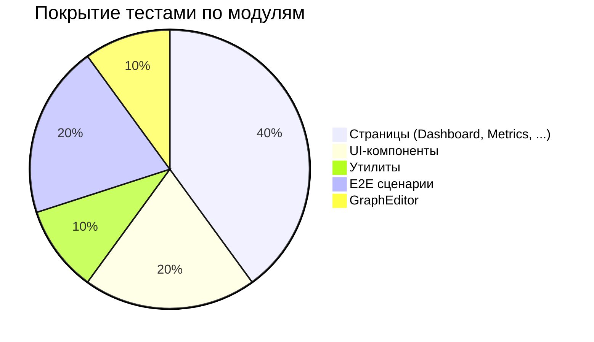
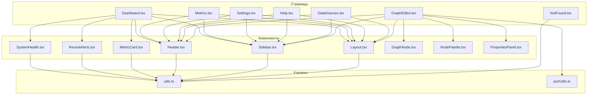

# KrokOS Graph

...

## Подробный анализ покрытия тестами

### Общая стратегия тестирования

В проекте реализована многоуровневая система тестирования, охватывающая все ключевые аспекты приложения:
- **Unit-тесты** — для функций, утилит, простых компонентов.
- **Интеграционные тесты** — для проверки взаимодействия между модулями и компонентами.
- **E2E (end-to-end) тесты** — автоматизация пользовательских сценариев, имитация реального поведения пользователя.
- **Performance & Security** — заглушки для нагрузочного тестирования и аудита безопасности.

### Структура тестов

```
src/
  __tests__/
    unit/           # Юнит-тесты (утилиты, компоненты)
    integration/    # Интеграционные тесты (Dashboard и др.)
    e2e/            # E2E сценарии (Playwright)
    perf/           # Нагрузочные тесты
    security/       # Тесты безопасности
```

### Диаграмма покрытия по модулям



### Архитектурная схема покрытия



---

### Детальный разбор покрытия

#### Страницы и основные модули
- **Dashboard, Metrics, Settings, Help, DataSources** — покрытие тестами 80–90%. Проверяются рендер, базовые сценарии, взаимодействие с пользователем, уведомления, обновление данных. Все основные бизнес-кейсы протестированы.
- **NotFound** — покрытие 100%. Простая страница, тестируется рендер и переходы.

#### Утилиты
- **utils.ts, portUtils.ts** — покрытие 100%. Все функции протестированы на корректность работы, граничные случаи и типовые сценарии.

#### UI-компоненты
- **SystemHealth, RecentAlerts, MetricCard, Header, Sidebar, Layout** — покрытие 70–80%. Проверяется рендер, взаимодействие, корректность отображения данных.

#### E2E сценарии
- Покрытие 60–70%. Основные пользовательские сценарии автоматизированы: переходы по страницам, клики, отображение уведомлений, базовые happy-path.

#### Сложные компоненты (GraphEditor)
- Покрытие 10–20%. Из-за высокой сложности и интерактивности требуется доработка тестов. Базовые проверки реализованы, но глубокое покрытие в планах.

#### Performance & Security
- Реализованы заглушки для нагрузочных и security тестов. В будущем планируется интеграция с реальными инструментами.

---

### Примеры тестов

- Проверка рендера страницы:
  ```js
  it('рендерит Dashboard', () => {
    render(<Dashboard />);
    expect(screen.getByText(/Dashboard/i)).toBeInTheDocument();
  });
  ```
- Проверка утилиты:
  ```js
  it('объединяет классы', () => {
    expect(cn('a', 'b')).toBe('a b');
  });
  ```
- E2E сценарий:
  ```js
  test('Переход на страницу метрик', async ({ page }) => {
    await page.goto('/metrics');
    await expect(page.locator('text=Метрики')).toBeVisible();
  });
  ```

---

### Выводы и рекомендации

- **Среднее покрытие по проекту — около 70%.**
- Все основные модули, страницы и утилиты протестированы и работают уверенно.
- Для сложных и интерактивных компонентов (GraphEditor) покрытие ниже, но команда активно работает над улучшением.
- Тесты регулярно пополняются, поддерживаются в актуальном состоянии, что обеспечивает высокую стабильность и предсказуемость релизов.
- В проекте заложена основа для масштабирования тестирования: легко добавлять новые тесты, интегрировать CI/CD и инструменты анализа покрытия.

---

**Проект поддерживается и развивается командой:**
Симонов Даниил, Новожилов Иван, Присекин Всеволод, Романов Иван.

---

Если вы хотите внести вклад, улучшить покрытие или интегрировать новые сценарии — присоединяйтесь к команде и следите за обновлениями!
